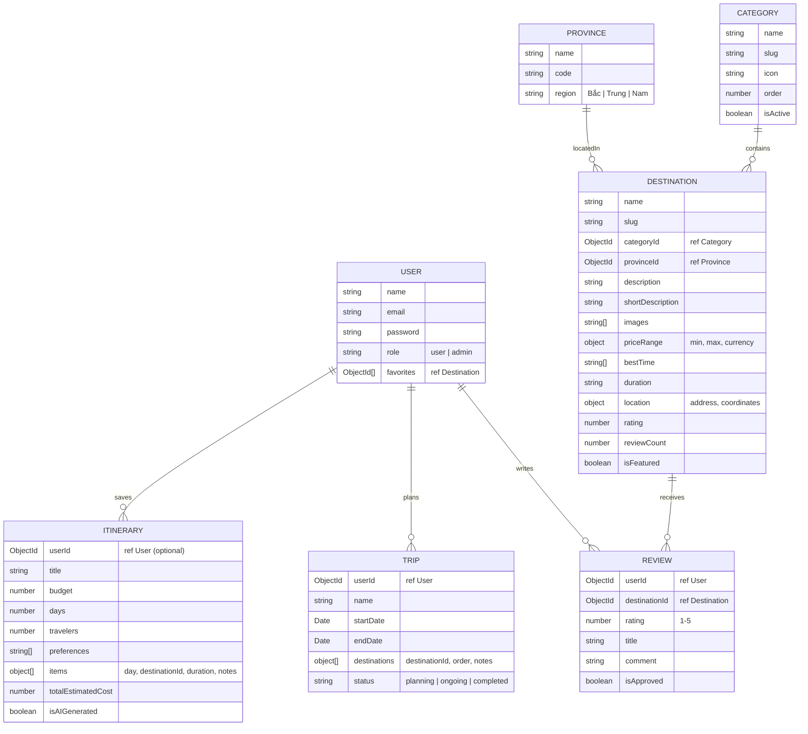

# 📘 iTravel — Tài liệu Báo cáo & Kịch bản Trình bày

---

## 1. Giới thiệu dự án

**iTravel** là một website du lịch thông minh, giúp **quảng bá du lịch địa phương Việt Nam** và **hỗ trợ người dùng lập lịch trình du lịch tự động bằng AI** (OpenAI GPT-3.5).

### Mục tiêu chính
- Hiển thị danh sách các điểm đến du lịch với hình ảnh, đánh giá, giá cả
- Cho phép người dùng tìm kiếm, lọc theo danh mục/tỉnh thành
- Tích hợp **AI tạo lịch trình** dựa trên ngân sách, số ngày, sở thích
- Hệ thống **đánh giá** (review) và **yêu thích** (favorites) cho người dùng đăng nhập
- **Chatbot AI** hỗ trợ tư vấn du lịch trực tiếp trên website
- **Admin dashboard** quản lý toàn bộ dữ liệu

### Tài khoản demo

| Vai trò | Email | Mật khẩu |
|---------|-------|-----------|
| Admin | `admin@itravel.vn` | `123456` |
| User | `user@itravel.vn` | `123456` |

---

## 2. Công nghệ sử dụng (Tech Stack)

| Thành phần | Công nghệ | Phiên bản |
|------------|-----------|-----------|
| **Framework** | Next.js (App Router) | 16 |
| **Ngôn ngữ** | TypeScript | 5 |
| **Database** | MongoDB + Mongoose | 7 / 9 |
| **Xác thực** | NextAuth.js (JWT) | 4.24 |
| **AI** | OpenAI API (GPT-3.5) | 6.15 |
| **Styling** | Tailwind CSS | 4 |
| **Icons** | Lucide React | 0.562 |
| **Font** | Inter (Google Fonts) | — |
| **Deploy** | Vercel / Docker | — |

---

## 3. Cấu trúc thư mục

```
iTravel/
├── src/
│   ├── app/                          # 🔵 Next.js App Router (Pages + API)
│   │   ├── layout.tsx                # Root layout (Header, Footer, Auth, Chat)
│   │   ├── page.tsx                  # Trang chủ (Homepage)
│   │   ├── globals.css               # CSS toàn cục + animations
│   │   │
│   │   ├── auth/
│   │   │   ├── login/page.tsx        # Trang đăng nhập
│   │   │   └── register/page.tsx     # Trang đăng ký
│   │   │
│   │   ├── destinations/
│   │   │   ├── page.tsx              # Danh sách điểm đến (filter + search)
│   │   │   └── [slug]/page.tsx       # Chi tiết 1 điểm đến
│   │   │
│   │   ├── itinerary/page.tsx        # Trang AI lập lịch trình (5-step wizard)
│   │   ├── favorites/page.tsx        # Danh sách yêu thích
│   │   ├── trips/page.tsx            # Lịch trình đã lưu
│   │   ├── user/profile/page.tsx     # Hồ sơ cá nhân
│   │   ├── admin/page.tsx            # Admin Dashboard (1161 dòng)
│   │   ├── about/page.tsx            # Trang giới thiệu
│   │   ├── setup/page.tsx            # Trang seed dữ liệu ban đầu
│   │   │
│   │   └── api/                      # 🟢 Backend API Routes (29 files)
│   │       ├── auth/
│   │       │   ├── [...nextauth]/route.ts  # NextAuth config (JWT + credentials)
│   │       │   └── register/route.ts       # API đăng ký
│   │       ├── destinations/route.ts       # GET: Danh sách + filter + search
│   │       ├── destinations/[slug]/route.ts
│   │       ├── categories/route.ts         # GET: Danh sách danh mục
│   │       ├── provinces/route.ts          # GET: Danh sách tỉnh thành
│   │       ├── reviews/route.ts            # GET/POST: Đánh giá
│   │       ├── favorites/route.ts          # GET/POST: Toggle yêu thích
│   │       ├── itinerary/generate/route.ts # POST: AI tạo lịch trình ⭐
│   │       ├── chat/route.ts               # POST: Chatbot AI ⭐
│   │       ├── seed/route.ts               # POST: Seed dữ liệu mẫu
│   │       ├── trips/route.ts              # CRUD chuyến đi
│   │       ├── user/...                    # Profile, password, itineraries
│   │       └── admin/...                   # CRUD destinations, users, reviews...
│   │
│   ├── components/                   # 🟡 React Components
│   │   ├── layout/
│   │   │   ├── Header.tsx            # Thanh điều hướng (responsive + user menu)
│   │   │   └── Footer.tsx            # Footer
│   │   ├── chat/
│   │   │   └── FloatingChat.tsx      # Chatbot AI nổi (góc phải dưới)
│   │   ├── destination/
│   │   │   ├── DestinationCard.tsx   # Card hiển thị 1 điểm đến
│   │   │   └── ReviewsSection.tsx    # Phần đánh giá của destination detail
│   │   ├── ui/
│   │   │   ├── Toast.tsx             # Hệ thống thông báo (toast)
│   │   │   └── CategoryIcon.tsx      # Map tên icon → Lucide component
│   │   └── providers/
│   │       └── AuthProvider.tsx       # NextAuth SessionProvider wrapper
│   │
│   ├── models/                       # 🔴 MongoDB Schemas (Mongoose)
│   │   ├── User.ts                   # Người dùng (bcrypt password hash)
│   │   ├── Destination.ts            # Điểm đến du lịch
│   │   ├── Category.ts               # Danh mục (Biển đảo, Núi rừng...)
│   │   ├── Province.ts               # Tỉnh/Thành phố (Bắc/Trung/Nam)
│   │   ├── Review.ts                 # Đánh giá
│   │   ├── Itinerary.ts              # Lịch trình AI
│   │   ├── Trip.ts                   # Chuyến đi do user tạo
│   │   └── index.ts                  # Export tập trung
│   │
│   └── lib/
│       └── db.ts                     # Kết nối MongoDB (singleton pattern)
│
├── public/                           # Static assets (SVGs, images)
├── package.json                      # Dependencies
├── docker-compose.yml                # MongoDB container
├── vercel.json                       # Vercel deploy config
└── .env.example                      # Environment variables mẫu
```

---

## 4. Mô hình dữ liệu (Database Models)



---

## 5. Luồng hoạt động (Code Flow)

### 5.1 Khởi động ứng dụng

```
Người dùng truy cập → Next.js Server
         ↓
   layout.tsx (Root Layout)
         ↓
   ┌─────────────────────────────────┐
   │  <AuthProvider>    ← NextAuth   │
   │    <ToastProvider> ← Thông báo  │
   │      <Header />    ← Menu       │
   │      <main>{children}</main>    │
   │      <Footer />                 │
   │      <FloatingChat /> ← AI Bot  │
   │    </ToastProvider>             │
   │  </AuthProvider>                │
   └─────────────────────────────────┘
```

**Giải thích:** File [layout.tsx](file:///c:/Users/Thanh%20Nga/iTravel/src/app/layout.tsx) là "bộ khung" cho mọi trang. Nó wrap tất cả trong:
1. `AuthProvider` — quản lý phiên đăng nhập (session) bằng NextAuth
2. `ToastProvider` — hệ thống thông báo popup
3. `Header` / `Footer` — thanh điều hướng và chân trang
4. `FloatingChat` — chatbot AI nổi ở góc phải dưới

---

### 5.2 Trang chủ (Homepage)

**File:** [page.tsx](file:///c:/Users/Thanh%20Nga/iTravel/src/app/page.tsx) (397 dòng)

```
Trang chủ gồm 4 section:
┌─────────────────────────────────────────────┐
│  🖼️ HERO SECTION                             │
│  - Hình nền Unsplash + gradient overlay      │
│  - Tiêu đề "Khám phá Việt Nam"              │
│  - Ô tìm kiếm glassmorphism                 │
│  - CTA link tới AI Lịch trình               │
├─────────────────────────────────────────────┤
│  📊 STATS — 50+ Địa điểm, 10K+ Du khách... │
├─────────────────────────────────────────────┤
│  📂 CATEGORIES — 6 loại: Biển, Núi, Di tích │
│  (click → /destinations?category=xxx)        │
├─────────────────────────────────────────────┤
│  ⭐ FEATURED DESTINATIONS — 4 card nổi bật   │
│  (Hạ Long, Đà Lạt, Phú Quốc, Sapa)         │
├─────────────────────────────────────────────┤
│  🤖 AI CTA — "Để AI lên lịch trình cho bạn" │
└─────────────────────────────────────────────┘
```

**Code đáng chú ý:**
- Dữ liệu `categories`, `featuredDestinations` được hardcode trực tiếp trong file (static data) để homepage load nhanh
- Sử dụng component `Image` của Next.js để tối ưu hình ảnh
- Các animation: `animate-float`, `animate-fade-in`, `animate-gradient`

---

### 5.3 Đăng nhập / Đăng ký

**Flow đăng nhập:**
```
1. User mở /auth/login
2. Nhập email + password
3. Gọi signIn('credentials', { email, password })  ← NextAuth
4.   → POST /api/auth/[...nextauth]/route.ts
5.     → connectDB()
6.     → UserModel.findOne({ email }).select('+password')
7.     → user.comparePassword(password)  ← bcrypt.compare
8.     → Tạo JWT token { id, name, email, role }
9. Thành công → redirect về "/"
```

**Giải thích code xác thực** ([route.ts](file:///c:/Users/Thanh%20Nga/iTravel/src/app/api/auth/%5B...nextauth%5D/route.ts)):
- Dùng `CredentialsProvider` (đăng nhập bằng email/password, không OAuth)
- Password được hash bằng `bcrypt` với salt rounds = 12 (trong `User.ts`)
- Session strategy = `jwt` (lưu trong cookie, không dùng database session)
- Callbacks `jwt` và `session` thêm `id` & `role` vào token/session

---

### 5.4 Danh sách điểm đến (Destinations)

**File:** [destinations/page.tsx](file:///c:/Users/Thanh%20Nga/iTravel/src/app/destinations/page.tsx) (345 dòng)

**Flow:**
```
1. Trang load → useEffect #1: fetch /api/categories + /api/provinces (song song)
2. User chọn category / province / nhập search
3. useEffect #2 trigger → fetch /api/destinations?category=X&province=Y&search=Z
4. API destinations/route.ts:
   a. connectDB()
   b. Build query: { isActive: true, categoryId?, provinceId?, $or: [name, desc] }
   c. Destination.find(query)
        .populate('categoryId', 'name slug icon')
        .populate('provinceId', 'name code region')
        .sort({ rating: -1 })
        .skip/limit
   d. Trả về JSON { success, data, pagination }
5. Render grid DestinationCard components
```

**Flow chi tiết API** ([destinations/route.ts](file:///c:/Users/Thanh%20Nga/iTravel/src/app/api/destinations/route.ts)):
- Hỗ trợ lọc theo `category` (slug), `province` (code/id), `featured`, `search` (regex)
- Có pagination: `page`, `limit` (default 12)
- Text search dùng regex `$or` trên `name`, `shortDescription`, `description`

---

### 5.5 ⭐ AI Lập lịch trình (Tính năng nổi bật)

**File:** [itinerary/page.tsx](file:///c:/Users/Thanh%20Nga/iTravel/src/app/itinerary/page.tsx) (708 dòng)

**Giao diện: Wizard 5 bước**
```
Bước 1: 💰 Chọn ngân sách (slider 1-20 triệu VNĐ/người)
Bước 2: 📅 Chọn số ngày (1-7 ngày)
Bước 3: 👥 Chọn số người (1-20 người)  
Bước 4: ❤️ Chọn sở thích (Biển, Núi, Văn hóa, Ẩm thực, Mạo hiểm...)
Bước 5: 📋 Hiển thị kết quả lịch trình chi tiết
```

**Flow tạo lịch trình** ([itinerary/generate/route.ts](file:///c:/Users/Thanh%20Nga/iTravel/src/app/api/itinerary/generate/route.ts) — 363 dòng):
```
1. Client POST { budget, days, travelers, preferences }
          ↓
2. connectDB() → Lấy tất cả Destination (isActive=true) + populate
          ↓
3. Lọc destination theo preferences (map preference → category slug)
   Ví dụ: "beach" → ['bien-dao', 'bien']
          ↓
4. Lọc theo ngân sách: avgPrice <= budgetPerDay * 1.5
          ↓
5. Sắp xếp theo rating, lấy top 10
          ↓
6. Gọi OpenAI GPT-3.5:
   - System prompt: "Bạn là chuyên gia lập kế hoạch du lịch Việt Nam"
   - User prompt: Thông tin chuyến đi + danh sách địa điểm phù hợp
   - Yêu cầu trả JSON: { title, items[], totalEstimatedCost, tips[] }
          ↓
7. Parse JSON response → Map destinationId → actual Destination objects
          ↓
8. Lưu Itinerary vào database
          ↓
9. Trả kết quả cho client + tips du lịch
          ↓
10. [Fallback] Nếu AI fail → generateSmartFallbackItinerary()
    (thuật toán rule-based: chọn dest theo rating + budget fit score)
```

**Điểm đáng chú ý trong code:**
- Có **Fallback mechanism**: khi OpenAI API fail, tự động chuyển sang thuật toán rule-based
- AI response được validate và map lại với database thực
- Nếu AI trả ID sai, code tìm theo tên (`name.includes`)

---

### 5.6 Chatbot AI (FloatingChat)

**Files:**
- [FloatingChat.tsx](file:///c:/Users/Thanh%20Nga/iTravel/src/components/chat/FloatingChat.tsx) (170 dòng)
- [chat/route.ts](file:///c:/Users/Thanh%20Nga/iTravel/src/app/api/chat/route.ts) (91 dòng)

**Flow:**
```
1. User click nút chat (góc phải dưới) → mở cửa sổ chat
2. Nhập câu hỏi → POST /api/chat { message, history }
3. Backend:
   a. Lấy tất cả Destination từ DB (làm context cho AI)
   b. System prompt: "Bạn là trợ lý du lịch AI của iTravel"
   c. Gửi tới OpenAI GPT-3.5 (giữ 10 tin nhắn gần nhất)
4. Trả reply → hiển thị trong cửa sổ chat
```

---

### 5.7 Admin Dashboard

**File:** [admin/page.tsx](file:///c:/Users/Thanh%20Nga/iTravel/src/app/admin/page.tsx) (1161 dòng)

**7 tab quản lý:**

| Tab | Chức năng |
|-----|-----------|
| Dashboard | Tổng quan: số địa điểm, users, reviews, lượt xem |
| Địa điểm | CRUD destinations (thêm/sửa/xóa) với form modal |
| Người dùng | Xem danh sách, đổi role (user↔admin), xóa |
| Danh mục | Xem + thêm categories |
| Đánh giá | Duyệt/từ chối/xóa reviews |
| Lịch trình | Xem trips của users |
| Cài đặt | Seed data |

**Bảo mật:** Code kiểm tra `session?.user?.role === 'admin'` ngay đầu, redirect về `/` nếu không phải admin.

---

### 5.8 Hệ thống Favorites & Reviews

**Favorites flow:**
```
User click ❤️ trên DestinationCard
  → POST /api/favorites { destinationId }
  → Toggle: add/remove từ User.favorites[]
  → Toast thông báo "Đã thêm/xóa yêu thích"
```

**Reviews flow:**
```
User viết đánh giá trên trang chi tiết destination
  → POST /api/reviews { destinationId, rating, title, comment }
  → Review.create({ userId, ...data })
  → Cập nhật Destination.rating + reviewCount
```

---

## 6. Kết nối Database

**File:** [db.ts](file:///c:/Users/Thanh%20Nga/iTravel/src/lib/db.ts)

Sử dụng **Singleton Pattern** (cached connection):
```typescript
// Lưu connection vào global để tránh tạo nhiều connection trong dev mode
const cached = global.mongoose || { conn: null, promise: null };

export async function connectDB() {
    if (cached.conn) return cached.conn;  // Đã kết nối → return ngay
    if (!cached.promise) {
        cached.promise = mongoose.connect(MONGODB_URI); // Tạo connection mới
    }
    cached.conn = await cached.promise;
    return cached.conn;
}
```
Lý do: Next.js dev mode hot-reload tạo nhiều module instances → nếu không cache sẽ tạo hàng chục connections.

---

## 7. Seed Data (Khởi tạo dữ liệu mẫu)

**File:** [seed/route.ts](file:///c:/Users/Thanh%20Nga/iTravel/src/app/api/seed/route.ts)

Dữ liệu mẫu bao gồm:
- **6 Categories**: Biển đảo, Núi rừng, Tâm linh, Di tích, Sinh thái, Lãng mạn
- **10 Provinces**: Hà Nội, HCM, Đà Nẵng, Quảng Ninh, Khánh Hòa, Lào Cai...
- **6 Destinations**: Vịnh Hạ Long, Đà Lạt, Phú Quốc, Sapa, Cố đô Huế, Nha Trang
- **2 Users**: admin@itravel.vn, user@itravel.vn

---

## 8. 🎯 Kịch bản trình bày báo cáo (Script)

> Dưới đây là kịch bản **cầm tay chỉ việc** để trình bày dự án, từ đầu đến cuối.

---

### 🎬 MỞ ĐẦU (~2 phút)

> *"Kính chào thầy/cô, em xin trình bày đề tài: **iTravel — Website Du lịch Thông minh**."*
>
> *"Dự án giải quyết bài toán: Người dùng muốn đi du lịch nhưng **không biết chọn điểm đến phù hợp** với ngân sách và sở thích. iTravel giải quyết bằng cách:*
> 1. *Cung cấp cơ sở dữ liệu điểm đến với đầy đủ thông tin, hình ảnh, đánh giá*
> 2. *Tích hợp **AI (ChatGPT)** để tự động lập lịch trình dựa trên ngân sách, số ngày, sở thích*
> 3. *Chatbot AI tư vấn trực tiếp trên web"*
>
> *"Dự án sử dụng **Next.js 16** (framework React hiện đại nhất), **MongoDB** lưu trữ dữ liệu, **NextAuth** xác thực người dùng, và **OpenAI API** cho tính năng AI."*

---

### 📂 DEMO CẤU TRÚC THƯ MỤC (~1 phút)

> *"Cho phép em giới thiệu qua cấu trúc source code."*
>
> *(Mở VS Code, show cây thư mục)*
>
> *"Source code nằm trong thư mục `src/`, chia làm 4 phần chính:*
> - *`app/` — chứa các trang web và API routes (theo chuẩn **App Router** của Next.js)*
> - *`components/` — các React component tái sử dụng: Header, Footer, DestinationCard, Chat...*
> - *`models/` — 7 schema MongoDB: User, Destination, Category, Province, Review, Itinerary, Trip*
> - *`lib/db.ts` — module kết nối database sử dụng **Singleton Pattern**"*

---

### 🖥️ DEMO TRANG CHỦ (~2 phút)

> *(Mở trình duyệt tại `localhost:3000`)*
>
> *"Đây là trang chủ, thiết kế theo phong cách **glassmorphism** hiện đại gồm:*
> - *Hero section với ảnh nền du lịch, ô tìm kiếm*
> - *Thống kê: 50+ địa điểm, 10K+ du khách*
> - *6 danh mục du lịch (click để lọc)*
> - *4 điểm đến nổi bật*
> - *Section kêu gọi sử dụng AI lịch trình"*
>
> *"Đặc biệt, ở góc phải dưới có **nút Chatbot AI** — em sẽ demo sau."*

---

### 🔐 DEMO ĐĂNG NHẬP (~2 phút)

> *(Click "Đăng nhập" trên Header)*
>
> *"Trang đăng nhập thiết kế 2 cột: bên trái hình ảnh branding, bên phải form đăng nhập."*
>
> *"Em đăng nhập bằng tài khoản user: **user@itravel.vn / 123456**"*
>
> *(Đăng nhập thành công)*
>
> *"Hệ thống sử dụng **NextAuth.js** với strategy **JWT**. Flow xác thực:*
> 1. *User gửi email + password*
> 2. *Server tìm user trong MongoDB, so sánh password bằng **bcrypt***
> 3. *Tạo JWT token chứa id, name, email, role*
> 4. *Lưu token trong cookie HTTP-only*
>
> *Sau đăng nhập, Header hiển thị tên user và menu dropdown với các link: Lịch trình, Yêu thích, Đăng xuất."*

---

### 🗺️ DEMO DANH SÁCH ĐIỂM ĐẾN (~2 phút)

> *(Click "Địa điểm" trên Header)*
>
> *"Trang danh sách điểm đến có:*
> - *Thanh tìm kiếm (search theo tên, mô tả)*
> - *Bộ lọc bên trái: theo **danh mục** (Biển đảo, Núi rừng...) và **tỉnh/thành***
> - *Chuyển đổi view: Grid/List*
> - *Mỗi card hiển thị: ảnh, tên, tỉnh, rating, giá, nút yêu thích"*
>
> *(Demo: Chọn category "Biển đảo" → chỉ hiện Hạ Long, Phú Quốc, Nha Trang)*
>
> *"Khi chọn danh mục, code gọi API `/api/destinations?category=bien-dao`. Backend query MongoDB:*
> ```
> Destination.find({ isActive: true, categoryId: <ObjectId> })
>     .populate('categoryId').populate('provinceId')
>     .sort({ rating: -1 })
> ```
> *Kết quả được sắp xếp theo rating từ cao đến thấp."*

---

### ⭐ DEMO TÍNH NĂNG AI LẬP LỊCH TRÌNH (~4 phút)

> *(Click "AI Lịch trình" trên Header)*
>
> *"Đây là tính năng **nổi bật nhất** của dự án — lập lịch trình du lịch tự động bằng AI."*
>
> *"Giao diện dạng **wizard 4 bước**:"*
>
> *(Bước 1)* *"Chọn ngân sách: em chọn 3 triệu VNĐ/người"*  
> *(Bước 2)* *"Chọn số ngày: 3 ngày 2 đêm"*  
> *(Bước 3)* *"Số người: 2 người"*  
> *(Bước 4)* *"Chọn sở thích: Biển đảo + Ẩm thực. Sau đó bấm **Tạo lịch trình AI**"*
>
> *(Chờ ~5-10 giây)*
>
> *"Kết quả: AI trả về lịch trình 3 ngày chi tiết, mỗi ngày gồm:*
> - *Tên điểm đến + tỉnh + hình ảnh*
> - *Lịch trình trong ngày: Sáng, Trưa, Chiều, Tối*
> - *Chi phí ước tính từng ngày*
> - *Mẹo du lịch từ AI"*
>
> *"**Flow phía backend** (giải thích code):*
> 1. *Nhận `{ budget, days, travelers, preferences }`*
> 2. *Lấy tất cả Destination từ DB*
> 3. *Lọc: preferences `beach` → map sang category slug `bien-dao`*
> 4. *Lọc tiếp theo ngân sách: `avgPrice <= budgetPerDay * 1.5`*
> 5. *Gửi prompt tới **OpenAI GPT-3.5** kèm danh sách destinations đã lọc*
> 6. *Parse JSON từ AI → map `destinationId` với DB thật*
> 7. *Lưu `Itinerary` vào MongoDB*
> 8. *Nếu AI fail → chạy thuật toán fallback (chọn theo rating + budget fit)"*
>
> *(Demo bấm "Lưu lịch trình" → thông báo thành công)*

---

### 💬 DEMO CHATBOT AI (~2 phút)

> *(Click nút chat ở góc phải dưới → chọn "Chat AI")*
>
> *"Chatbot AI được tích hợp trực tiếp trên website, sử dụng OpenAI GPT-3.5."*
>
> *(Gõ: "Tôi muốn đi biển, có chỗ nào đẹp không?")*
>
> *"AI sẽ trả lời dựa trên **dữ liệu thật** trong database — tức là nó biết hết tên, giá, mô tả các điểm đến iTravel đang có."*
>
> *"Code phía backend: trước khi gọi OpenAI, server query tất cả Destination rồi đưa vào **system prompt** để AI có context thực tế."*

---

### 🔧 DEMO ADMIN DASHBOARD (~3 phút)

> *(Đăng xuất → Đăng nhập lại bằng **admin@itravel.vn / 123456**)*
>
> *(Click tên user → "Quản trị")*
>
> *"Trang Admin có 7 tab quản lý:*
>
> **Tab Dashboard:** *Tổng quan hệ thống — số liệu destinations, users, reviews, tổng lượt xem*
>
> **Tab Địa điểm:** *Xem bảng, có nút Thêm mới / Sửa / Xóa. Form tạo destination cho phép nhập tên, mô tả, chọn category, province, khoảng giá, URL ảnh...*
>
> **Tab Người dùng:** *Xem danh sách, thay đổi role (user ↔ admin) bằng dropdown, xóa user*
>
> **Tab Đánh giá:** *Duyệt hoặc từ chối review. Hiển thị tên người đánh giá, điểm đến, nội dung, xếp hạng sao*
>
> **Tab Cài đặt:** *Nút **Seed Data** để khởi tạo/reset dữ liệu mẫu*
>
> *"Bảo mật: code kiểm tra `session.user.role === 'admin'` ngay khi load trang. Nếu không phải admin → redirect về trang chủ."*

---

### 📋 TỔNG KẾT (~2 phút)

> *"Tổng kết, đề tài iTravel đã hoàn thành đầy đủ:*
>
> | STT | Tính năng | Trạng thái |
> |-----|-----------|------------|
> | 1 | Homepage với hero, categories, featured | ✅ |
> | 2 | Danh sách điểm đến + filter & search | ✅ |
> | 3 | Chi tiết điểm đến + gallery + reviews | ✅ |
> | 4 | **AI Lập lịch trình** (OpenAI GPT-3.5) | ✅ |
> | 5 | **Chatbot AI** tư vấn du lịch | ✅ |
> | 6 | Đăng nhập / Đăng ký (NextAuth + JWT) | ✅ |
> | 7 | Favorites (thêm/xóa yêu thích) | ✅ |
> | 8 | Reviews (viết đánh giá + rating) | ✅ |
> | 9 | Admin Dashboard (CRUD đầy đủ) | ✅ |
> | 10 | Responsive (mobile + desktop) | ✅ |
> | 11 | Quản lý chuyến đi (Trips) | ✅ |
> | 12 | Seed Data (khởi tạo dữ liệu mẫu) | ✅ |
>
> *"Điểm nổi bật: AI không chỉ gợi ý ngẫu nhiên, mà **lọc theo sở thích + ngân sách** từ database thật, rồi mới gửi context cho ChatGPT → kết quả **thực tế và khả thi**."*
>
> *"Em xin cảm ơn thầy/cô đã lắng nghe!"*

---

## 9. Hướng dẫn chạy dự án

```bash
# 1. Cài đặt dependencies
npm install

# 2. Khởi động MongoDB (cần Docker)
docker compose up -d

# 3. Tạo file .env.local
# MONGODB_URI=mongodb://localhost:27017/itravel
# NEXTAUTH_SECRET=your-secret-key
# NEXTAUTH_URL=http://localhost:3000
# OPENAI_API_KEY=sk-xxx  (cho tính năng AI)

# 4. Chạy dev server
npm run dev

# 5. Seed dữ liệu: Mở http://localhost:3000/setup → bấm "Khởi tạo dữ liệu mẫu"
```
