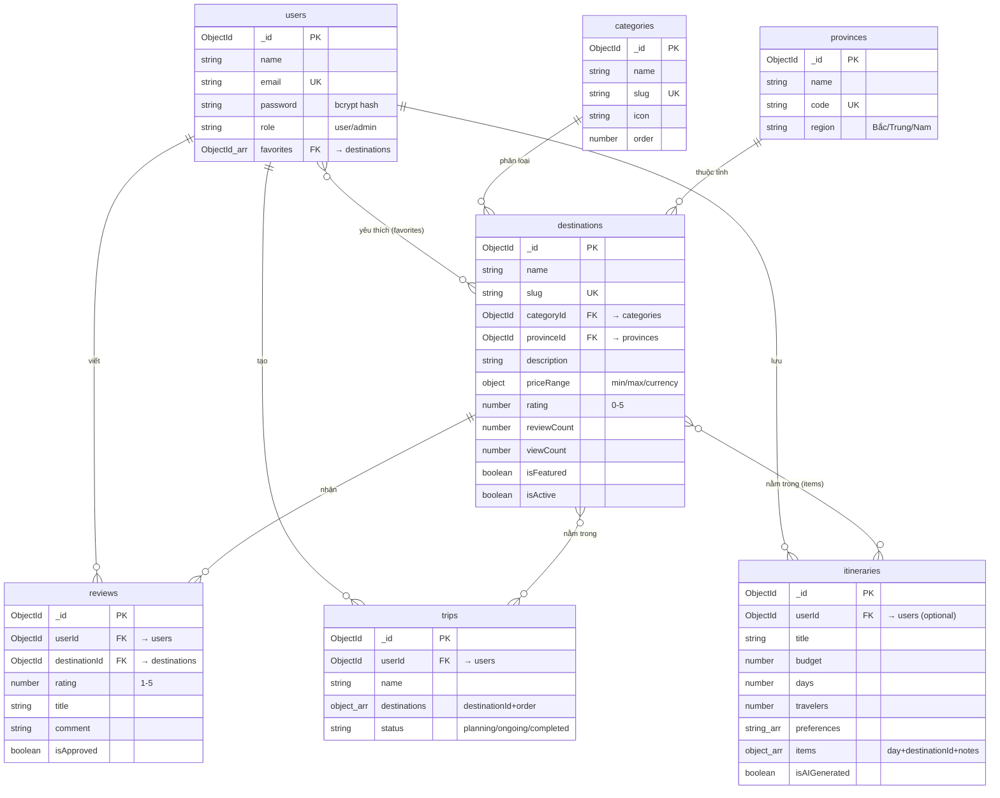

# 🗄️ iTravel — Tài liệu Database chi tiết

---

## 1. Tổng quan

| Thông tin | Giá trị |
|-----------|---------|
| **Hệ quản trị CSDL** | MongoDB (NoSQL Document) |
| **ODM** | Mongoose 9.0 |
| **Kết nối** | `src/lib/db.ts` — Singleton Pattern |
| **Connection URI** | `mongodb://localhost:27017/itravel` |
| **Số collection** | 7 |
| **Triển khai** | Docker container (xem `docker-compose.yml`) |

### Tại sao chọn MongoDB?
- **Linh hoạt schema**: Destination có nhiều trường lồng nhau (priceRange, location, coordinates) — MongoDB lưu dạng JSON tự nhiên hơn SQL
- **Populate (JOIN)**: Mongoose hỗ trợ `populate()` giống JOIN giữa các collection
- **Text Search**: Hỗ trợ tìm kiếm tiếng Việt bằng regex
- **Tích hợp tốt** với Next.js / Node.js ecosystem

---

## 2. Kết nối Database — Singleton Pattern

**File:** `src/lib/db.ts`

```typescript
// Cache connection ở biến global để tránh tạo nhiều connection khi hot-reload
const cached: MongooseConnection = global.mongoose || { conn: null, promise: null };

export async function connectDB() {
    if (cached.conn) return cached.conn;           // Đã kết nối → dùng lại
    if (!cached.promise) {
        cached.promise = mongoose.connect(URI);     // Lần đầu → tạo connection
    }
    cached.conn = await cached.promise;
    return cached.conn;
}
```

**Vấn đề giải quyết:** Next.js dev mode (hot module reload) tạo module mới mỗi lần save file → nếu không cache sẽ mở hàng chục connection tới MongoDB → lỗi `MongoServerError: too many open connections`.

**Cách dùng:** Mọi API route gọi `await connectDB()` ở đầu function.

---

## 3. Các Collection (Schema chi tiết)

### 3.1 `users` — Người dùng

**File:** `src/models/User.ts`

| Trường | Kiểu | Bắt buộc | Mặc định | Ghi chú |
|--------|------|----------|----------|---------|
| `name` | String | ✅ | — | Họ tên |
| `email` | String | ✅ | — | `unique`, `lowercase` |
| `password` | String | ✅ | — | `select: false` (ẩn khi query) |
| `avatar` | String | — | — | URL ảnh đại diện |
| `role` | String | — | `'user'` | Enum: `'user'` \| `'admin'` |
| `favorites` | ObjectId[] | — | `[]` | Ref → `Destination` |
| `createdAt` | Date | auto | — | Mongoose `timestamps` |
| `updatedAt` | Date | auto | — | Mongoose `timestamps` |

**Middleware & Methods:**

```typescript
// Pre-save hook: Hash password trước khi lưu vào DB
UserSchema.pre('save', async function () {
    if (!this.isModified('password')) return;    // Chỉ hash khi password thay đổi
    this.password = await bcrypt.hash(this.password, 12);  // Salt rounds = 12
});

// Instance method: So sánh password khi đăng nhập
UserSchema.methods.comparePassword = async function (candidatePassword) {
    return bcrypt.compare(candidatePassword, this.password);
};
```

**Đặc biệt:**
- `password` có `select: false` → khi query `User.find()` sẽ **không trả về** password
- Khi cần check password (đăng nhập): phải dùng `.select('+password')` explicitly
- `favorites` là **mảng ObjectId** tham chiếu tới collection `destinations` → dùng `populate('favorites')` để lấy chi tiết

---

### 3.2 `destinations` — Điểm đến du lịch ⭐

**File:** `src/models/Destination.ts`

| Trường | Kiểu | Bắt buộc | Mặc định | Ghi chú |
|--------|------|----------|----------|---------|
| `name` | String | ✅ | — | Tên điểm đến |
| `slug` | String | ✅ | — | `unique`, URL-friendly |
| `categoryId` | ObjectId | ✅ | — | Ref → `Category` |
| `provinceId` | ObjectId | ✅ | — | Ref → `Province` |
| `description` | String | ✅ | — | Mô tả dài |
| `shortDescription` | String | ✅ | — | Mô tả ngắn (cho card) |
| `images` | String[] | — | `[]` | URLs ảnh (Unsplash) |
| `priceRange` | Object | ✅ | — | `{ min, max, currency }` |
| `priceRange.min` | Number | ✅ | — | Giá thấp nhất (VNĐ) |
| `priceRange.max` | Number | ✅ | — | Giá cao nhất (VNĐ) |
| `priceRange.currency` | String | — | `'VND'` | — |
| `bestTime` | String[] | — | — | VD: `['Tháng 3','Tháng 4']` |
| `duration` | String | — | — | VD: `'2-3 ngày'` |
| `location.address` | String | — | — | Địa chỉ text |
| `location.coordinates.lat` | Number | — | — | Vĩ độ |
| `location.coordinates.lng` | Number | — | — | Kinh độ |
| `amenities` | String[] | — | — | VD: `['Kayak','Hang động']` |
| `rating` | Number | — | `0` | Trung bình sao (1-5) |
| `reviewCount` | Number | — | `0` | Tổng số đánh giá |
| `viewCount` | Number | — | `0` | Tổng lượt xem |
| `isFeatured` | Boolean | — | `false` | Hiện trên homepage |
| `isActive` | Boolean | — | `true` | Ẩn/hiện điểm đến |
| `createdAt` | Date | auto | — | — |
| `updatedAt` | Date | auto | — | — |

**Indexes (chỉ mục):**
```typescript
DestinationSchema.index({ name: 'text', description: 'text' });  // Full-text search
DestinationSchema.index({ categoryId: 1, provinceId: 1 });       // Compound: lọc theo category + province
DestinationSchema.index({ rating: -1 });                          // Sắp xếp theo rating giảm dần
```

**Mục đích từng index:**
1. **Text index** (`name + description`): Hỗ trợ `$text: { $search }` cho tìm kiếm. Tuy nhiên, code thực tế dùng regex thay vì `$text` để tìm kiếm tiếng Việt tốt hơn.
2. **Compound index** (`categoryId + provinceId`): Tăng tốc lọc kết hợp category + province (trang Destinations).
3. **Single index** (`rating: -1`): Tăng tốc sắp xếp theo rating (descending) — dùng ở mọi listing.

---

### 3.3 `categories` — Danh mục du lịch

**File:** `src/models/Category.ts`

| Trường | Kiểu | Bắt buộc | Mặc định | Ghi chú |
|--------|------|----------|----------|---------|
| `name` | String | ✅ | — | VD: "Biển đảo" |
| `slug` | String | ✅ | — | `unique`, VD: "bien-dao" |
| `icon` | String | ✅ | — | Tên Lucide icon: "Waves" |
| `description` | String | — | — | Mô tả |
| `order` | Number | — | `0` | Thứ tự hiển thị |
| `isActive` | Boolean | — | `true` | — |

**Dữ liệu mẫu (seed):**

| name | slug | icon |
|------|------|------|
| Biển đảo | bien-dao | Waves |
| Núi rừng | nui-rung | Mountain |
| Tâm linh | tam-linh | Church |
| Di tích | di-tich | Landmark |
| Sinh thái | sinh-thai | TreePine |
| Lãng mạn | lang-man | Heart |

---

### 3.4 `provinces` — Tỉnh/Thành phố

**File:** `src/models/Province.ts`

| Trường | Kiểu | Bắt buộc | Mặc định | Ghi chú |
|--------|------|----------|----------|---------|
| `name` | String | ✅ | — | VD: "Quảng Ninh" |
| `code` | String | ✅ | — | `unique`, VD: "QN" |
| `region` | String | ✅ | — | Enum: `'Bắc'` \| `'Trung'` \| `'Nam'` |
| `isActive` | Boolean | — | `true` | — |

**Dữ liệu mẫu:** 10 tỉnh/thành: Hà Nội (HN), HCM, Đà Nẵng (DN), Quảng Ninh (QN), Khánh Hòa (KH), Lào Cai (LC), Thừa Thiên Huế (TTH), Kiên Giang (KG), Lâm Đồng (LD), Bình Thuận (BTH)

---

### 3.5 `reviews` — Đánh giá

**File:** `src/models/Review.ts`

| Trường | Kiểu | Bắt buộc | Mặc định | Ghi chú |
|--------|------|----------|----------|---------|
| `userId` | ObjectId | ✅ | — | Ref → `User` |
| `destinationId` | ObjectId | ✅ | — | Ref → `Destination` |
| `rating` | Number | ✅ | — | `min: 1, max: 5` |
| `title` | String | ✅ | — | Tiêu đề đánh giá |
| `comment` | String | ✅ | — | Nội dung |
| `images` | String[] | — | — | Ảnh đánh giá |
| `isApproved` | Boolean | — | `true` | Admin duyệt |

**Indexes:**
```typescript
ReviewSchema.index({ destinationId: 1, createdAt: -1 });  // Lấy reviews theo destination, mới nhất trước
ReviewSchema.index({ userId: 1 });                          // Lấy reviews của 1 user
```

---

### 3.6 `itineraries` — Lịch trình AI

**File:** `src/models/Itinerary.ts`

| Trường | Kiểu | Bắt buộc | Mặc định | Ghi chú |
|--------|------|----------|----------|---------|
| `userId` | ObjectId | — | — | Ref → `User` (optional) |
| `title` | String | ✅ | — | AI tạo, VD: "3 ngày khám phá biển" |
| `budget` | Number | ✅ | — | Ngân sách/người (VNĐ) |
| `days` | Number | ✅ | — | Số ngày |
| `travelers` | Number | — | `1` | Số người |
| `preferences` | String[] | — | — | VD: `['beach','food']` |
| `items` | Array | — | — | Mảng lịch trình theo ngày |
| `items[].day` | Number | ✅ | — | Ngày thứ mấy |
| `items[].destinationId` | ObjectId | ✅ | — | Ref → `Destination` |
| `items[].duration` | String | — | — | "Cả ngày" / "Nửa ngày" |
| `items[].notes` | String | — | — | Gợi ý từ AI |
| `totalEstimatedCost` | Number | — | `0` | Tổng chi phí ước tính |
| `isAIGenerated` | Boolean | — | `false` | true = AI, false = fallback |

---

### 3.7 `trips` — Chuyến đi (user tự tạo)

**File:** `src/models/Trip.ts`

| Trường | Kiểu | Bắt buộc | Mặc định | Ghi chú |
|--------|------|----------|----------|---------|
| `userId` | ObjectId | ✅ | — | Ref → `User`, indexed |
| `name` | String | ✅ | `'Chuyến đi của tôi'` | — |
| `description` | String | — | — | — |
| `startDate` | Date | — | — | Ngày bắt đầu |
| `endDate` | Date | — | — | Ngày kết thúc |
| `destinations` | Array | — | — | Danh sách điểm đến |
| `destinations[].destinationId` | ObjectId | ✅ | — | Ref → `Destination` |
| `destinations[].order` | Number | — | `0` | Thứ tự |
| `destinations[].notes` | String | — | — | Ghi chú |
| `destinations[].plannedDate` | Date | — | — | Ngày dự kiến |
| `budget` | Number | — | — | Ngân sách |
| `travelers` | Number | — | `1` | Số người |
| `status` | String | — | `'planning'` | Enum: `planning` \| `ongoing` \| `completed` |
| `isPublic` | Boolean | — | `false` | — |

**Index:**
```typescript
TripSchema.index({ userId: 1, createdAt: -1 });  // Lấy trips của 1 user, mới nhất trước
```

---

## 4. Sơ đồ quan hệ (ER Diagram)



---

## 5. Các Query Pattern (Mẫu truy vấn)

### 5.1 Populate (Tương đương JOIN trong SQL)

MongoDB không có JOIN, nhưng Mongoose cung cấp `populate()` để thay thế:

```typescript
// 🔹 Populate đơn giản — lấy destination kèm category & province
Destination.find(query)
    .populate('categoryId', 'name slug icon')    // Chỉ lấy 3 trường từ Category
    .populate('provinceId', 'name code region')  // Chỉ lấy 3 trường từ Province

// 🔹 Populate lồng nhau (nested) — lấy favorites của user, mỗi favorite populate tiếp
User.findById(id).populate({
    path: 'favorites',                    // Array ObjectId → Destination documents
    populate: [
        { path: 'categoryId', select: 'name icon' },   // Destination.categoryId → Category
        { path: 'provinceId', select: 'name' },         // Destination.provinceId → Province
    ],
})

// 🔹 Populate sâu 2 cấp — Trip → destinations → destinationId → provinceId
Trip.find({ userId })
    .populate({
        path: 'destinations.destinationId',
        select: 'name slug images rating priceRange provinceId',
        populate: { path: 'provinceId', select: 'name' },  // Cấp 2
    })
```

> **So sánh SQL:** Tương đương `SELECT * FROM trips JOIN destinations ON ... JOIN provinces ON ...` nhưng code Mongoose trực quan hơn với nested objects.

---

### 5.2 Filter + Search + Pagination

```typescript
// API: GET /api/destinations?category=bien-dao&province=QN&search=biển&page=1&limit=12

const query: Record<string, unknown> = { isActive: true };

// 1. Lọc theo category slug → tìm ObjectId tương ứng
if (category) {
    const cat = await Category.findOne({ slug: category });
    query.categoryId = cat._id;
}

// 2. Lọc theo province code
if (province) {
    const prov = await Province.findOne({ code: province });
    query.provinceId = prov._id;
}

// 3. Tìm kiếm text (regex, case-insensitive)
if (search) {
    query.$or = [
        { name: { $regex: search, $options: 'i' } },
        { shortDescription: { $regex: search, $options: 'i' } },
        { description: { $regex: search, $options: 'i' } },
    ];
}

// 4. Thực thi query với pagination
const [destinations, total] = await Promise.all([
    Destination.find(query)
        .populate('categoryId', 'name slug icon')
        .populate('provinceId', 'name code region')
        .sort({ rating: -1, createdAt: -1 })
        .skip((page - 1) * limit)
        .limit(limit)
        .lean(),
    Destination.countDocuments(query),           // Tổng số kết quả (cho pagination)
]);
```

> **Lưu ý:** Dùng regex `$options: 'i'` thay vì `$text` search vì regex xử lý tiếng Việt có dấu tốt hơn.

---

### 5.3 Atomic Update — Tăng viewCount

```typescript
// API: GET /api/destinations/[slug]
// Tìm + tăng viewCount trong 1 atomic operation
const destination = await Destination.findOneAndUpdate(
    { slug, isActive: true },           // Điều kiện
    { $inc: { viewCount: 1 } },         // Tăng viewCount lên 1
    { new: true }                       // Trả về document đã cập nhật
)
.populate('categoryId', 'name slug icon')
.populate('provinceId', 'name code region');
```

> **Tại sao dùng `$inc`?** `$inc` là atomic operator — đảm bảo chính xác ngay cả khi nhiều user truy cập cùng lúc (race condition safe).

---

### 5.4 Related Destinations (Gợi ý liên quan)

```typescript
// Lấy destination detail → gợi ý 4 điểm đến cùng category HOẶC cùng province
const related = await Destination.find({
    _id: { $ne: destination._id },     // Loại trừ chính nó
    $or: [
        { categoryId: destination.categoryId },   // Cùng category
        { provinceId: destination.provinceId },   // HOẶC cùng province
    ],
    isActive: true,
}).limit(4);
```

---

### 5.5 Toggle Favorite (Thêm/Xóa yêu thích)

```typescript
// API: POST /api/favorites { destinationId }
const user = await User.findById(session.user.id);
const isFavorited = user.favorites.includes(destinationId);

if (isFavorited) {
    // XÓA: filter ra khỏi mảng
    user.favorites = user.favorites.filter(id => id.toString() !== destinationId);
} else {
    // THÊM: push vào mảng
    user.favorites.push(destinationId);
}
await user.save();
```

> **Thiết kế:** Favorites lưu trong `User.favorites[]` (embedded array) thay vì collection riêng → truy vấn nhanh hơn khi số lượng yêu thích nhỏ.

---

### 5.6 Tạo Review + Cập nhật Rating tự động

```typescript
// API: POST /api/reviews { destinationId, rating, title, comment }

// 1. Kiểm tra user đã review chưa (mỗi user chỉ review 1 lần/destination)
const existingReview = await Review.findOne({ userId, destinationId });
if (existingReview) return error('Bạn đã đánh giá địa điểm này rồi');

// 2. Tạo review mới
const review = await Review.create({ userId, destinationId, rating, title, comment });

// 3. Tính lại rating trung bình + cập nhật Destination
const reviews = await Review.find({ destinationId, isApproved: true });
const avgRating = reviews.reduce((sum, r) => sum + r.rating, 0) / reviews.length;
await Destination.findByIdAndUpdate(destinationId, {
    rating: Math.round(avgRating * 10) / 10,    // Làm tròn 1 chữ số thập phân
    reviewCount: reviews.length,
});
```

> **Quan trọng:** `rating` và `reviewCount` trong `Destination` là **denormalized data** (dữ liệu dư thừa tính toán sẵn) → tránh phải aggregate mỗi lần hiển thị destination card, tăng performance.

---

### 5.7 Tạo Trip — Find-or-Create Pattern

```typescript
// API: POST /api/trips { destinationId }

// Tìm trip "planning" gần nhất của user, hoặc tạo mới
let trip = await Trip.findOne({
    userId: session.user.id,
    status: 'planning',
}).sort({ updatedAt: -1 });

if (!trip) {
    // Chưa có → tạo trip mới
    trip = await Trip.create({
        userId: session.user.id,
        name: 'Chuyến đi của tôi',
        destinations: [{ destinationId, order: 0 }],
    });
} else {
    // Đã có → thêm destination vào trip (kiểm tra trùng lặp)
    const exists = trip.destinations.some(d => d.destinationId.toString() === destinationId);
    if (!exists) {
        trip.destinations.push({ destinationId, order: trip.destinations.length });
        await trip.save();
    }
}
```

---

### 5.8 Đăng ký User — Bcrypt & Middleware

```typescript
// API: POST /api/auth/register { name, email, password }

// 1. Validate input
if (password.length < 6) return error('Mật khẩu phải có ít nhất 6 ký tự');

// 2. Kiểm tra email trùng
const existing = await User.findOne({ email: email.toLowerCase() });
if (existing) return error('Email đã được sử dụng');

// 3. Tạo user — password sẽ tự động hash bởi pre('save') middleware
const user = await User.create({ name, email: email.toLowerCase(), password, role: 'user' });
// Lúc này trong DB, password đã là: "$2a$12$xK3w..." (bcrypt hash)
```

---

### 5.9 AI Itinerary — Lọc Destination cho ChatGPT

```typescript
// API: POST /api/itinerary/generate

// 1. Lấy tất cả destination active
const destinations = await Destination.find({ isActive: true })
    .populate('categoryId', 'name slug icon')
    .populate('provinceId', 'name code region')
    .lean();  // .lean() → trả plain JS object (nhanh hơn Mongoose document)

// 2. Lọc theo preferences → category slug
const targetCategories = preferences.flatMap(p => preferenceToCategory[p] || []);
// VD: preferences=['beach'] → targetCategories=['bien-dao','bien']
filteredDestinations = destinations.filter(d =>
    targetCategories.includes(d.categoryId?.slug || '')
);

// 3. Lọc tiếp theo ngân sách
filteredDestinations = filteredDestinations.filter(d => {
    const avgPrice = (d.priceRange.min + d.priceRange.max) / 2;
    return avgPrice <= budgetPerPersonPerDay * 1.5;     // Cho phép linh hoạt 50%
});

// 4. Sắp xếp rating, lấy top 10 → gửi cho ChatGPT
const top10 = filteredDestinations.sort((a, b) => b.rating - a.rating).slice(0, 10);

// 5. Sau khi AI trả kết quả → lưu Itinerary vào DB
const itinerary = await Itinerary.create({
    title: aiResult.title,
    budget, days, travelers, preferences,
    items: items.map(i => ({ day, destinationId, duration, notes })),
    totalEstimatedCost: finalTotal,
    isAIGenerated: true,
});
```

---

## 6. Seed Data (Khởi tạo dữ liệu mẫu)

**File:** `src/app/api/seed/route.ts`

**Flow:**
```
POST /api/seed
    ↓
1. Xóa toàn bộ dữ liệu cũ (5 collection)
   await Category.deleteMany({})
   await Province.deleteMany({})
   await Destination.deleteMany({})
   await User.deleteMany({})
   await Review.deleteMany({})
    ↓
2. Insert 6 categories
    ↓
3. Insert 10 provinces
    ↓
4. Insert 6 destinations (sử dụng ObjectId từ bước 2, 3)
    ↓
5. Tạo 2 users: admin + user (password auto-hash bởi middleware)
    ↓
6. Trả kết quả: { categories: 6, provinces: 10, destinations: 6, users: 2 }
```

**Destinations mẫu:**

| Tên | Category | Province | Rating | Giá (VNĐ) |
|-----|----------|----------|--------|------------|
| Vịnh Hạ Long | Biển đảo | Quảng Ninh | 4.8 | 1.5M – 5M |
| Đà Lạt | Núi rừng | Lâm Đồng | 4.7 | 800K – 3M |
| Phú Quốc | Biển đảo | Kiên Giang | 4.6 | 2M – 8M |
| Sapa | Núi rừng | Lào Cai | 4.7 | 1M – 4M |
| Cố đô Huế | Di tích | TT-Huế | 4.5 | 600K – 2.5M |
| Nha Trang | Biển đảo | Khánh Hòa | 4.5 | 1.2M – 4.5M |

---

## 7. Tổng hợp tất cả API ↔ Database

| API Route | Method | Collection | Operation | Ghi chú |
|-----------|--------|------------|-----------|---------|
| `/api/auth/[...nextauth]` | POST | `users` | `findOne` + `comparePassword` | Đăng nhập |
| `/api/auth/register` | POST | `users` | `findOne` + `create` | Đăng ký |
| `/api/destinations` | GET | `destinations`, `categories`, `provinces` | `find` + `populate` × 2 + `countDocuments` | Danh sách + filter |
| `/api/destinations/[slug]` | GET | `destinations` | `findOneAndUpdate` ($inc viewCount) + `find` (related) | Chi tiết + gợi ý |
| `/api/categories` | GET | `categories` | `find` | Danh sách danh mục |
| `/api/provinces` | GET | `provinces` | `find` | Danh sách tỉnh |
| `/api/reviews` | GET | `reviews` | `find` + `populate` + `countDocuments` | Reviews + pagination |
| `/api/reviews` | POST | `reviews`, `destinations` | `findOne` + `create` + `findByIdAndUpdate` | Tạo review + update rating |
| `/api/favorites` | GET | `users` | `findById` + `populate` (nested) | Danh sách yêu thích |
| `/api/favorites` | POST | `users` | `findById` + `save` (push/filter array) | Toggle yêu thích |
| `/api/itinerary/generate` | POST | `destinations`, `itineraries` | `find` + `populate` + `create` | AI lịch trình |
| `/api/chat` | POST | `destinations` | `find` + `populate` (context cho AI) | Chatbot |
| `/api/trips` | GET | `trips` | `find` + nested `populate` × 2 | Danh sách chuyến đi |
| `/api/trips` | POST | `trips` | `findOne` + `create` / `save` | Tạo/thêm chuyến đi |
| `/api/seed` | POST | ALL 5 | `deleteMany` × 5 + `insertMany` × 3 + `create` × 2 | Reset & seed |
| `/api/admin/*` | CRUD | All | Full CRUD operations | Quản trị |

---

## 8. Performance & Design Patterns

| Pattern | Áp dụng ở | Giải thích |
|---------|-----------|------------|
| **Singleton Connection** | `db.ts` | Cache connection tránh leak khi hot-reload |
| **Denormalized Data** | `Destination.rating`, `reviewCount` | Tính sẵn rating → không cần aggregate mỗi lần hiển thị |
| **Atomic Update** | `$inc: { viewCount: 1 }` | Race-condition safe cho viewCount |
| **Embedded Array** | `User.favorites[]`, `Trip.destinations[]` | Lưu trong document chính → đọc nhanh (1 query) |
| **Reference (Ref)** | `Destination.categoryId` → `Category` | Tách collection riêng cho data ít thay đổi |
| **Pre-save Hook** | `User.password` bcrypt | Tự động hash trước khi lưu DB |
| **Select: false** | `User.password` | Không trả password trong query mặc định |
| **Lean Query** | `.lean()` | Trả plain JS object thay vì Mongoose document → nhanh hơn 5-10x |
| **Compound Index** | `categoryId + provinceId` | Tăng tốc query filter kết hợp |
| **Unique Constraint** | `email`, `slug`, `code` | Database-level uniqueness validation |
